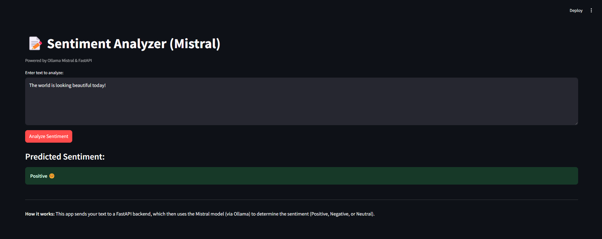
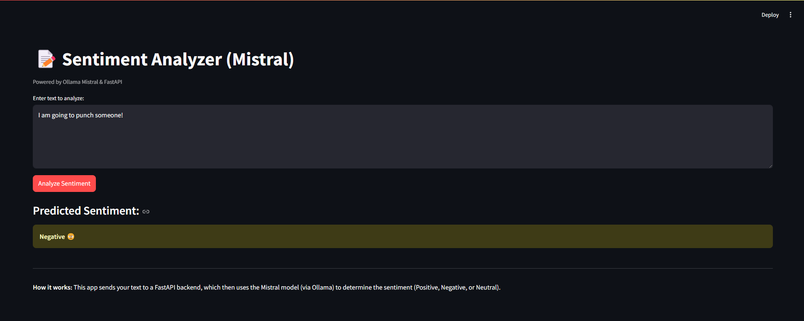
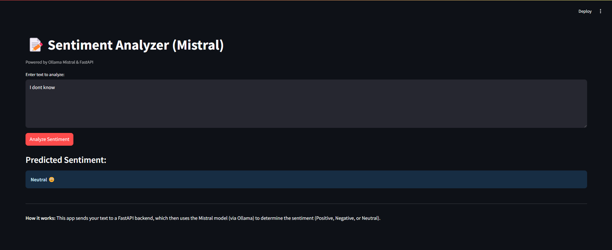

# Sentiment Analyzer (Mistral)

Sentiment Analyzer using Mistral via Ollama, integrated with FastAPI for the backend and Streamlit for the frontend.

## Overview
- **Task**: Given a text input, the system classifies whether the sentiment is positive, negative, or neutral.
- **Model**: mistral (lightweight and fast for general-purpose reasoning)

## Tech Stack
- **Backend**: FastAPI
- **Frontend**: Streamlit
- **Model Serving**: Ollama (Mistral model)
- **Version Control**: Git & GitHub

## Demo Results

**Positive Sentiment:**


**Negative Sentiment:**


**Neutral Sentiment:**


## Run Locally

1.  **Clone the repository:**
    ```bash
    git clone https://github.com/ashish-kj/SentimentAnalyzer.git
    cd sentimentanalyzer
    ```
2.  **Set up environment (Optional but recommended):**
    ```bash
    python -m venv venv
    # On Windows
    venv\Scripts\activate
    # On macOS/Linux
    # source venv/bin/activate 
    pip install -r requirements.txt
    ```
3.  **Ensure Ollama is running and pull the Mistral model:**
    ```bash
    ollama pull mistral
    ```
4.  **Start the backend server:**
    Open a terminal in the project root directory:
    ```bash
    uvicorn backend.main:app --reload
    ```
    The backend will be available at `http://localhost:8000`.

5.  **Start the frontend application:**
    Open another terminal in the project root directory:
    ```bash
    streamlit run frontend/app.py
    ```
    The frontend will open in your browser, usually at `http://localhost:8501`.
